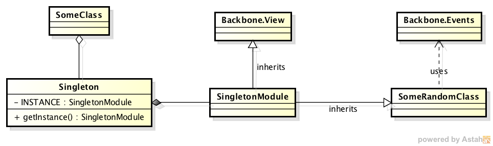

*****************************
A Backbone Singleton Scaffold
*****************************
I think one of the most intriguing design patterns in programming is the
Singleton; that is, an object that can only be instantiated once. I realize that
there are lots of arguments against using a Singleton; the most oft mentioned is
that it introduces global state in an application. But used within the context
of AMD such as RequireJS, scope is automatically limited to that of the module,
so a Singleton would only be *global* with respect to the module memory space.

Admittedly, the Singleton should only be used sparingly, and you should really
think about how or *if* you use one at all. Personally, I've found them useful
for things such as Confirmation modals, or even event dispatchers. They're very
cool.

Backbone Implementation
***********************

